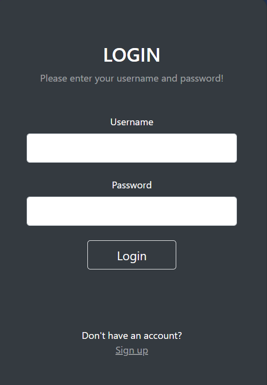

# week14

### 1. Simple Web Server + 3. Google Sheet API

- Sau khi chạy file server.py và mở localhost:5000 thì sẽ hiện lên 1 form login:
    

- Page `Signup` với option: `View Info` và `Sheet`:<br>
    

- Sqlite DB gồm 3 cột: `username`, `password` và `option`:<br>
    
    - Trường `option` nhận giá trị 1 tương ứng với `View Info` (exercise 1)
    - Giá trị 2 tương ứng `Sheet` (exercise 3)

- `View Info`:<br>
    

- `Sheet`: <br>
    - `Read`:
        
    - `Create`:
        
    - Tương tự với `Update` và `Delete`


### 2. Simple client
- Cú pháp:
```
python clients.py -m <METHOD> -data <DATA> -u <url>
```
- METHOD: GET, POST, HEAD, PUT, DELETE.
- Với POST và PUT, cần cả `username` và `password`
- Với DELETE, chỉ cần `username`
- Ví dụ:
```
 python clients.py -m GET -data "/" -u "127.0.0.1:5000"
```


```
python clients.py -m POST -data "username=admin&password=admin" -u "127.0.0.1:5000"

```

```
python clients.py -m DELETE -data "username=admin" -u "127.0.0.1:5000"

```

```
python clients.py -m PUT -data "username=123&password=123" -u "127.0.0.1:5000"

```


- DB sau khi thực hiện các method trên:<br>
    